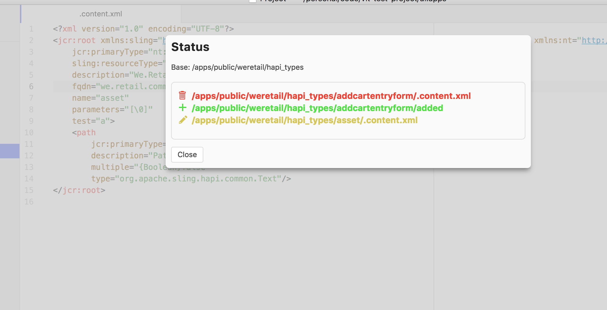

# vlt-atom

Atom Package to sync AEM project working copy with crx repository.

### Installation
1. Install Atom.
2. Install package
```shell
apm install vlt-atom
```
3. Add JAVA_HOME in your environment variables (if not present).

### Settings
- **AEM server host:** AEM server host or ip address.
- **AEM server port:** AEM Server port or blank if running on 80.
- **Username:** AEM admin username.
- **Password:** AEM admin password to login.
- **Vlt Base:** Vault directory path in file system. (Use the vault provided with your AEM package, under opt directory.)
- **Sync Service:** This can be used to enable service that will auto push your changes to crx.

### Usage
- Add an AEM project in Atom, right click on any directory under your project (jcr_root) and use Pull From Crx option. This will sync your working copy with AEM instance.
- Once everything is synced, options (Pull From Crx / Push To Crx) can be used to push or pull any file or directory from project panel.
- Add Under VLT option can be used to add any new file or directory under vlt control.
- Status option can be used to check difference between remote crx and local working copy.
 


### Important Notes:
- Update settings.xml file to add files or directories that needs to be ignored by vlt. This file can be created in META_INF/vault or under <userhome>/.vault directory. Below is an example for setting xml.
```xml
<?xml version="1.0" encoding="UTF-8"?>
<vault version="1.0">
   <ignore name=".svn"/>
   <ignore name=".git"/>
   <ignore name=".DS_Store"/>
   <ignore name=".dir"/>
</vault>
```
- Make sure to include jcr_root directory while adding an AEM project. This directory should be present in project panel before you start working.